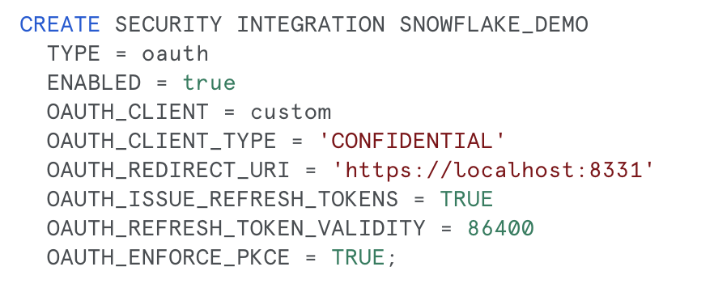

## READ BEFORE USING THE CONNECTIONS API FOR OAUTH 2.0 CONNECTIONS

### Requirements
Install and use a cert utility like `mkcert` in order to establish self-signed local certificates to allow the local server to recieve authorization codes from authorization servers via TLS/SSL. 

For example:

```
brew install mkcert
mkcert localhost
```
Ensure these certificates are in the directory of wherever you are running the databricks-cli from. For example if you are calling databricks-cli from `~`, then you should have your `.pem` keys in `~`

### Before Using the CLI for OAuth
* You must first create an OAuth connection object in the provider that you wish to use Lakehouse Federation with. For example in Snowflake you need to create a security integration by running a command like the one below:


You can then show the client id and client secret using the command:
```
SELECT SYSTEM$SHOW_OAUTH_CLIENT_SECRETS('SNOWFLAKE_DEMO')
```
* You can read more about the OAuth settings for security integrations in Snowflake [here](https://docs.snowflake.com/en/sql-reference/sql/create-security-integration-oauth-snowflake)


* You can perform a similar operation in Salesforce by going to the App Manager dashboard and creating a Connected Application and enabling OAuth settings with the redirect URL of `https://localhost:8331`. You can read more about using OAuth in salesforce [here](https://help.salesforce.com/s/articleView?id=sf.connected_app_create_api_integration.htm&type=5).

### When using the CLI you MUST set your redirect URL to `https://localhost:8331`

* After this configuration you should be able to use the connection as normal, using the `--help` flag on commands to see which arguments are available. 